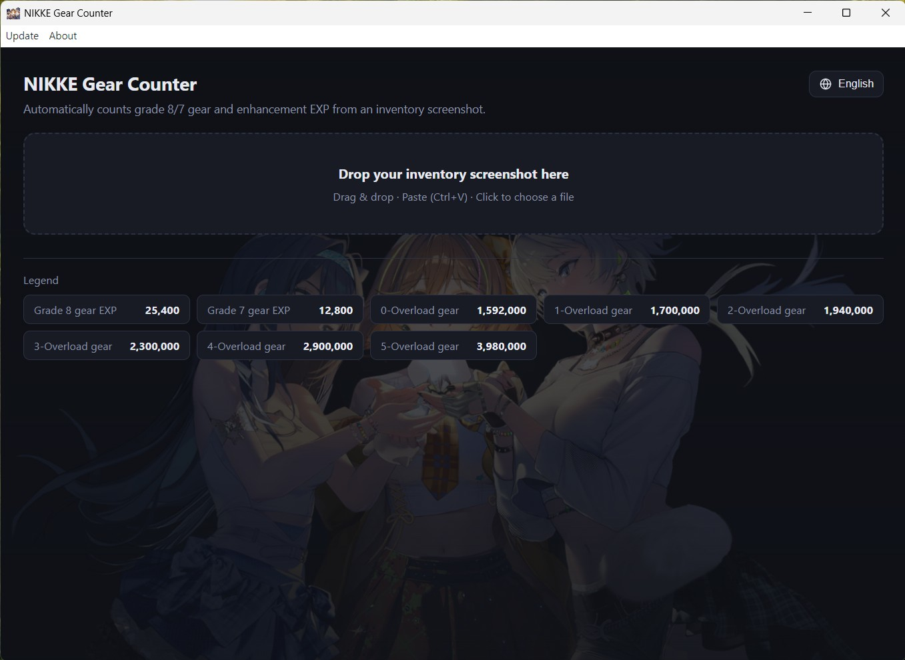
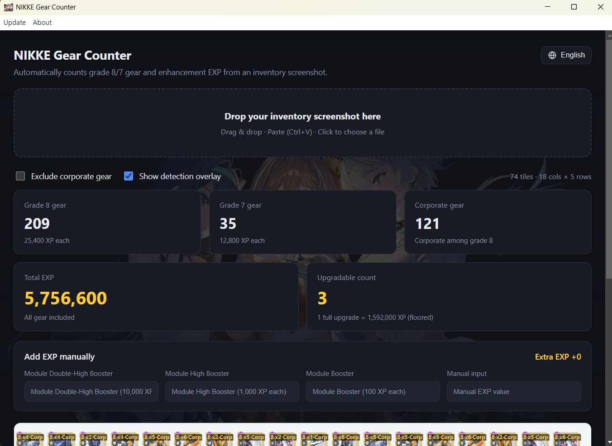
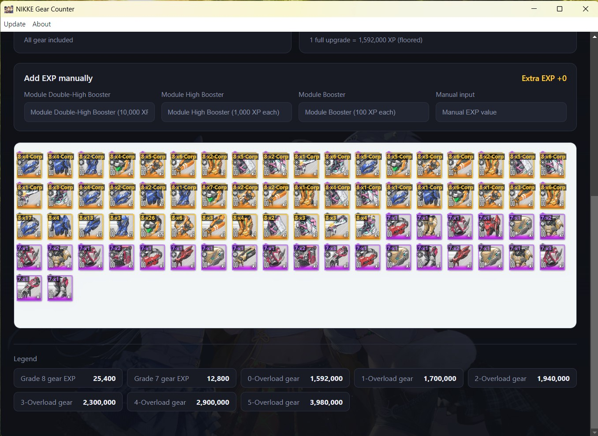

# NIKKE Gear Counter

> Read a NIKKE inventory screenshot and instantly calculate how many Overload gear you can build.

**Languages:** [English](#english) · [한국어](#한국어) · [日本語](#日本語)

  

---

## English

**NIKKE Gear Counter** is a desktop calculator that reads your NIKKE inventory
screenshot with on-device OCR / image analysis and tells you how many **Overload
gear** you can build from the gear you currently own.

Just drop in a capture of your gear inventory — the app counts your grade 8 / 7
gear, sums up the total enhancement EXP, and shows how many full Overload pieces
that EXP is worth.

### Features

- **Screenshot OCR** — Drag & drop, paste (`Ctrl+V`), or pick a file. The app
  detects every gear tile in the screenshot and reads its quantity automatically.
- **Automatic counting** — Tallies grade 8 and grade 7 gear, including a separate
  count for corporate gear among grade 8.
- **Total EXP & buildable count** — Sums the enhancement EXP and shows how many
  Overload gear you can make (1 full upgrade = 1,592,000 XP).
- **Exclude corporate gear** — Toggle corporate gear out of the EXP total.
- **Detection overlay** — Overlays detected tiles, grades, and recognized
  quantities on top of your screenshot so you can verify the result.
- **Add EXP manually** — Add Module Boosters or any custom EXP value on top.

### How to use

1. Capture the **Gear** tab of your in-game inventory.
2. Drop, paste (`Ctrl+V`), or select the image in the app.
3. Read your grade counts, total EXP, and buildable Overload count. Toggle
   *Exclude corporate gear* if needed.

  
  

### Privacy & design notes

- **No network usage** other than checking for app updates (via `github.com`).
  Your screenshots are analyzed entirely on your device and are never uploaded.
- Built with **Electron** and distributed as a standalone app — there's no server
  to host, so everything runs locally on your machine.

### Bug reports & feature requests

Email **nikketoolsbugreport@gmail.com**. If the app fails to recognize an image,
please **attach that image** — it directly helps improve detection accuracy.

### PATCH note
2026.06.22 v0.0.1 first release
2026.06.23 v0.0.3 fix typo, improve OCR accuracy

### Donation

If this tool helps you, you can support development here:
<https://www.paypal.com/ncp/payment/ZLRY3PYY6L4LJ>

> This is an unofficial fan-made tool and is not affiliated with the developers
> or publishers of NIKKE.

---

## 한국어

**NIKKE Gear Counter**는 NIKKE 인벤토리 캡처 화면을 기기 내부에서 OCR / 이미지
분석으로 읽어, 현재 보유한 장비로 **오버로드 장비**를 몇 개 만들 수 있는지
계산해 주는 데스크톱 계산기입니다.

장비 인벤토리 캡처를 넣기만 하면, 8/7등급 장비 수량을 세고 총 강화 경험치를
합산해 그 경험치로 오버로드 장비를 몇 개 만들 수 있는지 보여 줍니다.

### 기능

- **캡처 OCR** — 드래그 앤 드롭, 붙여넣기(`Ctrl+V`), 파일 선택. 캡처 화면에서
  모든 장비 타일을 검출하고 수량을 자동으로 읽어 들입니다.
- **자동 집계** — 8등급·7등급 장비 수량을 집계하며, 8등급 중 기업 장비 수도
  따로 보여 줍니다.
- **총 경험치 · 제작 가능 수** — 강화 경험치를 합산하고, 오버로드 장비를 몇 개
  만들 수 있는지 보여 줍니다(1개 완성 = 1,592,000 XP).
- **기업 장비 제외** — 기업 장비를 경험치 합산에서 제외하는 토글.
- **검출 오버레이** — 검출된 타일·등급·인식된 수량을 원본 위에 겹쳐 보여 줘
  결과를 눈으로 확인할 수 있습니다.
- **경험치 수동 추가** — 모듈 부스터나 임의의 경험치 값을 추가로 더할 수 있습니다.

### 사용법

1. 게임 인벤토리의 **장비** 탭 화면을 캡처합니다.
2. 앱에 이미지를 드래그 앤 드롭, 붙여넣기(`Ctrl+V`), 또는 파일 선택합니다.
3. 등급별 수량 · 총 경험치 · 제작 가능한 오버로드 장비 수가 표시됩니다. 필요하면
   *기업 장비 제외*를 켭니다.

### 개인정보 & 설계 관련

- 기능 업데이트 확인(`github.com` 조회)을 **제외하면 네트워크 사용이 없습니다.**
  캡처 화면은 전부 사용자 기기 안에서만 분석되며 절대 업로드되지 않습니다.
- 호스팅할 비용이 없어 서버 없이 동작하도록 **Electron**으로 개발했습니다.
  모든 처리는 사용자의 컴퓨터에서 로컬로 이루어집니다.

### 버그 리포트 & 기능 제안

**nikketoolsbugreport@gmail.com** 으로 메일 주세요. 인식하지 못하는 이미지가
있다면 **그 이미지를 함께 첨부**해 주시면 인식 성능 개선에 큰 도움이 됩니다.

### 도네이션

이 도구가 도움이 되셨다면 아래에서 개발을 후원하실 수 있습니다:
<https://www.paypal.com/ncp/payment/ZLRY3PYY6L4LJ>

> 본 프로젝트는 비공식 팬메이드 도구이며 NIKKE 개발사/배급사와 무관합니다.

---

## 日本語

**NIKKE Gear Counter** は、NIKKE のインベントリのキャプチャ画面を端末内の
OCR / 画像解析で読み取り、今持っている装備で **オーバーロード装備** を何個
作れるかを計算するデスクトップ計算機です。

装備インベントリのキャプチャを入れるだけで、グレード 8/7 装備の数を数え、
合計強化経験値を集計し、その経験値でオーバーロード装備を何個作れるかを
表示します。

### 機能

- **キャプチャ OCR** — ドラッグ＆ドロップ、貼り付け(`Ctrl+V`)、ファイル選択。
  キャプチャ画面からすべての装備タイルを検出し、数量を自動で読み取ります。
- **自動集計** — グレード 8・グレード 7 装備の数を集計し、グレード 8 のうち
  企業装備の数も別途表示します。
- **合計経験値・作成可能数** — 強化経験値を合計し、オーバーロード装備を何個
  作れるかを表示します（1 個完成 = 1,592,000 XP）。
- **企業装備を除外** — 企業装備を経験値合計から除外するトグル。
- **検出オーバーレイ** — 検出したタイル・グレード・認識した数量を元画像に
  重ねて表示し、結果を目で確認できます。
- **経験値の手動追加** — モジュールブースターや任意の経験値を上乗せできます。

### 使い方

1. ゲーム内インベントリの **装備** タブをキャプチャします。
2. アプリに画像をドラッグ＆ドロップ、貼り付け(`Ctrl+V`)、またはファイル選択します。
3. グレード別の数量・合計経験値・作成可能なオーバーロード装備数が表示されます。
   必要に応じて *企業装備を除外* をオンにします。

### プライバシー & 設計について

- アプリのアップデート確認(`github.com` への問い合わせ)を **除いて、ネットワーク
  通信は一切ありません。** キャプチャ画面はすべて端末内だけで解析され、
  アップロードされることはありません。
- ホスティング費用がないため、サーバー不要で動作するよう **Electron** で
  開発しました。すべての処理は利用者の PC 上でローカルに行われます。

### バグ報告 & 機能リクエスト

**nikketoolsbugreport@gmail.com** までメールしてください。認識できない画像が
あれば、**その画像を添付**していただけると認識精度の改善に大いに役立ちます。

### 寄付

このツールが役に立ったら、こちらから開発を支援できます:
<https://www.paypal.com/ncp/payment/ZLRY3PYY6L4LJ>

> 本プロジェクトは非公式のファンメイドツールであり、NIKKE の開発元・配信元とは
> 一切関係ありません。
